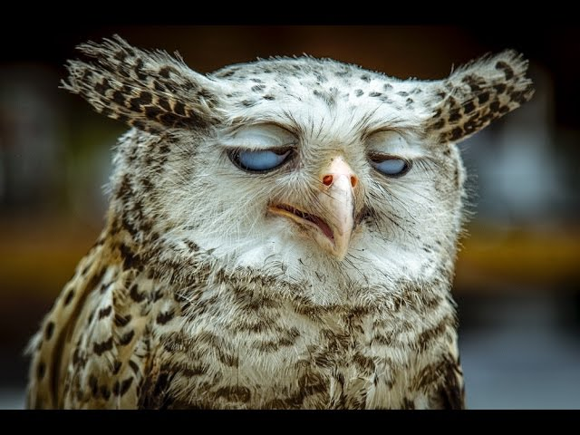

# Golang service to blur image

This app is just exercise to practice in `golang`, `vercel lambda`, `telegram api`

Web version is [here](https://telegram-bot-blur.mikhail.vercel.app)

Please pay attention, free [Vercel](https://vercel.com) plan allows to run lambda up to 10 second
so it cannot blur big pictures

The result looks like this:
|before|after|
|:-------|:------:|
|||

## License
MIT